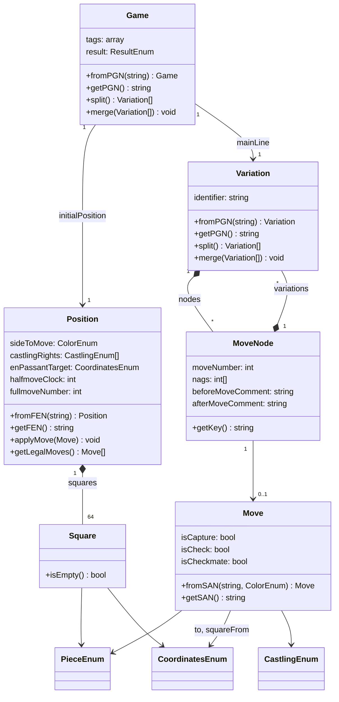

# ChessTools

A PHP library for parsing and exporting chess notations: **PGN**, **SAN**, and **FEN**.

## Table of Contents

1. [Installation](#installation)
2. [Quick Start](#quick-start)
3. [Tools](#tools)
4. [Model Layer](#model-layer)
5. [Enums Reference](#enums-reference)
6. [Testing & Development](#testing--development)

---

## Installation

Requires PHP >= 8.4.

```bash
composer require cmuset/chess-tools
```

---

## Quick Start

```php
use Cmuset\ChessTools\Model\Game;

// Parse a PGN string
$game = Game::fromPGN($pgn);

echo $game->getTag('White');     // 'Kasparov, Garry'
echo $game->getResult()->value;  // '1-0'

// Iterate moves
foreach ($game->getMainLine() as $key => $node) {
    echo $key . ' ' . $node->getMove()->getSAN(); // '1. e4', '1... e5', ...

    foreach ($node->getVariations() as $variation) {
        // Alternative lines branching from this move
    }
}

// Apply moves to a position
use Cmuset\ChessTools\Model\Position;
use Cmuset\ChessTools\Tool\Parser\PGNParser;

$pos = Position::fromFEN(PGNParser::INITIAL_FEN);
$pos->applyMove('e4');
$pos->applyMove('e5');
echo $pos->getFEN(); // 'rnbqkbnr/pppppppp/8/8/4P3/8/PPPP1PPP/RNBQKBNR b KQkq e3 0 1'

// Export
echo $game->getPGN();      // Full PGN with tags, comments, variations
echo $game->getLitePGN();  // Moves only
```

---

## Tools

### Parsers — [`docs/tools/parser.md`](docs/tools/parser.md)

Convert strings into model objects.

| Class       | Input              | Output             |
|-------------|--------------------|--------------------|
| `PGNParser` | PGN string         | `Game` or `Game[]` |
| `SANParser` | SAN string + color | `Move`             |
| `FENParser` | FEN string         | `Position`         |

```php
use Cmuset\ChessTools\Tool\Parser\PGNParser;

$parser = PGNParser::create();
$game   = $parser->parse($pgn);         // Game | Game[]
```

### Exporters — [`docs/tools/exporter.md`](docs/tools/exporter.md)

Serialize model objects back to strings.

| Class              | Input                 | Output     |
|--------------------|-----------------------|------------|
| `GameExporter`     | `Game` or `Variation` | PGN string |
| `MoveExporter`     | `Move`                | SAN string |
| `PositionExporter` | `Position`            | FEN string |

```php
$game->getPGN();        // full PGN
$game->getLitePGN();    // moves only
$game->getVerbosePgn(); // with resolved source squares and check/mate markers
$position->getFEN();
$move->getSAN();
```

### MoveApplier — [`docs/tools/move-applier.md`](docs/tools/move-applier.md)

Applies a `Move` to a `Position`, enforcing all chess rules: castling rights, en passant, promotion, counters, and post-move check validation.

```php
use Cmuset\ChessTools\Tool\MoveApplier\Exception\MoveApplyingException;

try {
    $pos->applyMove('Nf3');
} catch (MoveApplyingException $e) {
    echo $e->getMoveViolation()->value; // e.g. 'No piece found for the move'
}

$pos->getLegalMoves(); // Move[] — all legal moves for the side to move
```

### Validators — [`docs/tools/validator.md`](docs/tools/validator.md)

Check positions and games for illegal states.

| Class               | Validates                                                   |
|---------------------|-------------------------------------------------------------|
| `PositionValidator` | A single `Position` (kings, check, pawns, en passant)       |
| `GameValidator`     | A full `Game` — replays every move including sub-variations |

```php
use Cmuset\ChessTools\Tool\Validator\PositionValidator;
use Cmuset\ChessTools\Tool\Validator\GameValidator;

$violations = (new PositionValidator())->validate($pos);   // PositionViolationEnum[]
$violation  = (new GameValidator())->validate($game);      // ?GameViolation
```

### Resolvers — [`docs/tools/resolver.md`](docs/tools/resolver.md)

Derive information absent from raw SAN: source squares, capture flags, and check/checkmate markers.

| Class               | Resolves                                   |
|---------------------|--------------------------------------------|
| `MoveResolver`      | A single `Move` against a `Position`       |
| `VariationResolver` | All moves in a `Variation` sequentially    |
| `GameResolver`      | The full game main line + result detection |

```php
use Cmuset\ChessTools\Tool\Resolver\GameResolver;

GameResolver::create()->resolve($game);
// All moves now carry squareFrom, isCapture, isCheck, isCheckmate
```

### VariationSplitter — [`docs/tools/splitter.md`](docs/tools/splitter.md)

Extracts all nested variations into a flat list of independent `Variation` objects, each prefixed with the moves preceding the divergence.

```php
$variations = $game->split(); // Variation[] — first is always the main line
```

### VariationMerger — [`docs/tools/merger.md`](docs/tools/merger.md)

Merges `Variation` objects back into a main line, inserting diverging moves as nested sub-variations at the correct branching points.

```php
$game->merge($variationA, $variationB);
```

---

## Model Layer



| Class                                   | Description                                                                      | Docs                          |
|-----------------------------------------|----------------------------------------------------------------------------------|-------------------------------|
| [`Game`](docs/models/game.md)           | Full PGN game: tags, initial position, main line, result                         | [→](docs/models/game.md)      |
| [`Position`](docs/models/position.md)   | Board state: pieces, side to move, castling rights, en passant, counters         | [→](docs/models/position.md)  |
| [`Variation`](docs/models/variation.md) | Ordered collection of `MoveNode` instances, keyed by `"1."` / `"1..."` notation  | [→](docs/models/variation.md) |
| [`MoveNode`](docs/models/move-node.md)  | Node in the move tree: move + move number + comments + NAGs + sub-variations     | [→](docs/models/move-node.md) |
| [`Move`](docs/models/move.md)           | Parsed SAN move: piece, destination, flags (capture, check, castling, promotion) | [→](docs/models/move.md)      |
| [`Square`](docs/models/square.md)       | A board square: coordinates + optional piece                                     | [→](docs/models/square.md)    |

---

## Enums Reference

All domain concepts are PHP string-backed enums.

| Enum                                           | Values                                                                                              | Docs                                               |
|------------------------------------------------|-----------------------------------------------------------------------------------------------------|----------------------------------------------------|
| [`ColorEnum`](docs/enums/color.md)             | `WHITE` `'w'` · `BLACK` `'b'`                                                                       | [→](docs/enums/color.md)                           |
| [`PieceEnum`](docs/enums/piece.md)             | `WHITE_KING` `'K'` … `BLACK_PAWN` `'p'` (12 cases)                                                  | [→](docs/enums/piece.md)                           |
| [`CoordinatesEnum`](docs/enums/coordinates.md) | `A1` `'a1'` … `H8` `'h8'` (64 cases)                                                                | [→](docs/enums/coordinates.md)                     |
| [`CastlingEnum`](docs/enums/castling.md)       | `WHITE_KINGSIDE` `'K'` · `WHITE_QUEENSIDE` `'Q'` · `BLACK_KINGSIDE` `'k'` · `BLACK_QUEENSIDE` `'q'` | [→](docs/enums/castling.md)                        |
| [`ResultEnum`](docs/enums/result.md)           | `WHITE_WINS` `'1-0'` · `BLACK_WINS` `'0-1'` · `DRAW` `'1/2-1/2'` · `ONGOING` `'*'`                  | [→](docs/enums/result.md)                          |
| `CommentAnchorEnum`                            | `PRE` · `POST`                                                                                      | —                                                  |
| `MoveViolationEnum`                            | `PIECE_NOT_FOUND` · `WRONG_COLOR_TO_MOVE` · `CASTLING_IS_NOT_ALLOWED` …                             | [→](docs/tools/validator.md#moveviolationenum)     |
| `PositionViolationEnum`                        | `NO_WHITE_KING` · `KING_IN_CHECK` · `PAWN_ON_INVALID_RANK` …                                        | [→](docs/tools/validator.md#positionviolationenum) |

---

## Testing & Development

```bash
git clone https://github.com/clemuset/pgn-parser.git
cd pgn-parser
composer install
```

```bash
vendor/bin/phpunit                        # Run all tests
vendor/bin/phpunit tests/path/to/Test.php # Run a single test file
vendor/bin/phpunit --filter methodName    # Run a single test method

vendor/bin/phpstan analyse                # Static analysis (level 7)
vendor/bin/php-cs-fixer fix               # Fix code style
vendor/bin/php-cs-fixer fix --dry-run     # Check without applying changes
```

Or with Docker:

```bash
make check    # fix + analyse + test
make test
make analyse
make fix
```

---

MIT License. See `LICENSE`.
